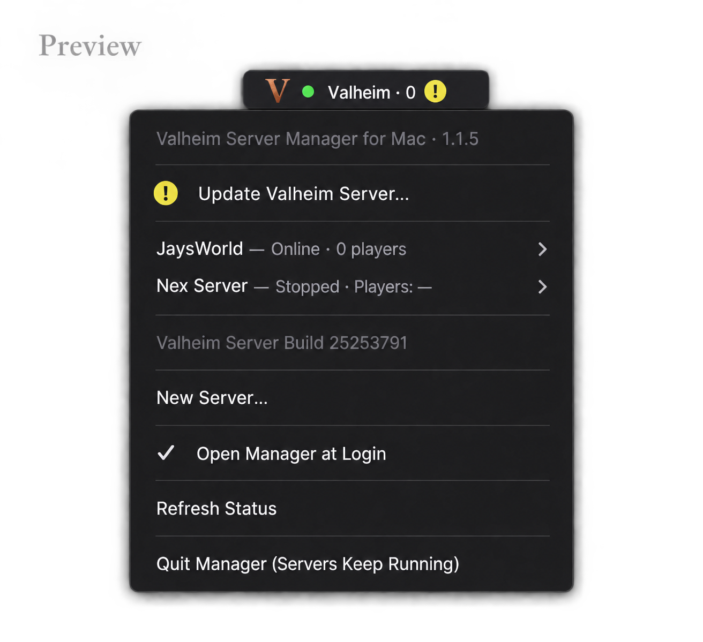

# Valheim Server Manager for Mac

Host a Valheim dedicated server on your Mac. This native macOS menu bar app installs the server, creates or imports worlds, and manages hosting in the background without keeping a terminal open.

**Requires macOS 13 Ventura or later.** The download includes Apple Silicon and Intel Mac binaries. Runtime testing is currently on Apple Silicon; Intel hardware validation is still pending. Allow 6 GB of free disk space for installation and updates. The hosting app is for macOS only.

**Version 1.1.4 is Developer ID signed and notarized by Apple**, with the notarization ticket attached.

[Download for Mac](https://github.com/GlacianNex/valheim-mac-server/releases/latest) · [Mac setup and recovery](docs/SETUP.md) · [Development](CONTRIBUTING.md)



## Getting started on your Mac

1. Download and unzip **Valheim-Server-Manager-for-Mac.zip**. Open the app and let it copy itself into Applications (or drag it there in Finder).
2. Choose **Install Native Server**. The app downloads the server directly from Valve; no Steam account, running Steam client, Python, or CrossOver is required. On Apple Silicon, Valve's installer may need a one-time Rosetta installation, which the app asks you to approve. The server runs natively on Apple Silicon.
3. Choose **New Server…**, set a server name, choose whether to **List my server**, and save. Listed servers require a password; unlisted servers can use an empty password. Hover over that server in the menu bar to start it or view its settings.

Crossplay is enabled by default, using Valheim's relay networking. The app displays the join code when the server reports one. Steam-only hosting requires forwarding the chosen UDP port and the next port on your router. The manager cannot change your router configuration.

macOS may show its normal first-open confirmation for an app downloaded from the internet.

Choose an optional **World seed** when creating a new server, or leave it blank for random generation. Existing and imported worlds show their saved seed read-only in settings.

## Included

- Automatic native server download and manual server updates, with installation progress and retry.
- An available server update adds a yellow **!** badge to the menu bar and an **Server Update Available — Update Now…** action at the top of the menu. Servers keep running until you approve the update.
- The menu shows the installed server's Steam build and checks Valve's stable release on launch and every 15 minutes while hosting continues. Click an available update to save, stop, update, and restart the servers that were running.
- Open a newer downloaded app and choose **Update & Open** to replace the installed manager while preserving profiles and worlds. If hosting, **Save, Stop & Update** saves and stops all running servers first. After a successful app update, each server starts if its auto-start setting is enabled or it was running before the update.
- Intel and Apple Silicon app binaries; macOS 13 or later.
- Multiple servers can run simultaneously, each with separate world files, logs, status, and startup preferences. New servers default to different UDP port pairs; conflicting active ports are rejected.
- Copy-only imports of a one-world ZIP, modern world folder, or legacy `.db` with matching `.fwl`.
- World presets, modifiers, saving/backup settings, and admin/ban/allow lists, with underlined hover help.
- Each server has a submenu with Start/Stop, settings, login startup, join-code copy, logs, and confirmed deletion. Deleted saves/settings are retained in a recovery folder.
- Imported world settings are displayed from the latest completed save without becoming launch overrides.
- Status light and last-reported player counts.
- Graceful Save & Stop; the app does not force-kill a server after a save timeout.
- Separate settings for opening the manager and starting each server at login. Running server settings remain viewable in read-only mode.
- An idle-sleep assertion while hosting. Closing a laptop lid or logging out can still stop hosting.

## How it works

The app and background service are Swift executables built from this repository; there are no third-party Swift package dependencies. The runtime and worlds are separate from the app bundle:

```text
~/Library/Application Support/Valheim Server Monitor/
  profiles.json       # settings and passwords, mode 0600
  worlds/<profile>/   # a separate save directory for each profile
  runtime/           # SteamCMD and the native server downloaded from Valve
  logs/               # shared tools and original server logs
  servers/<profile>/  # additional servers’ process state and logs
  deleted-servers/    # recoverable deleted saves and settings
```

Server control uses an app-owned record containing the PID, executable path, and process start time. It does not stop servers by a broad process-name match. Development uses an explicit isolated `VSM_HOME`; login-item mutations are disabled there. Existing CrossOver installations, third-party servers, and their launch agents are not discovered, modified, or migrated.

## Current limits

- Login startup runs after a user signs in, not before login. Hosting ends on logout or shutdown.
- Player counts come from server logs and may be stale or unavailable. This is not a live player-query protocol or an in-game activity audit.
- Some world modifiers persist in saves. An unchecked flag does not remove a previously saved modifier. The profile editor explains this behavior.
- Imports check packaging and required files, not every world chunk's internal integrity. Import from a stopped source server or a consistent backup.
- No automatic migration, mod manager, remote server control, or CrossOver backend.
- The app asks before installing Rosetta. Installing it accepts Apple's license and may require macOS authorization.
- Updates are manual and require stopping all app-managed servers because they share one runtime. One previous server runtime is retained for recovery; world backups are handled by Valheim.

## Build

Install Xcode or its command-line tools, then:

```sh
swift test
scripts/build.sh
```

The universal app and ZIP are written to `dist/`. See [release instructions](docs/RELEASING.md) for Developer ID signing and notarization.

## License and attribution

The manager code and its original server/mountain icon are MIT licensed. This is an unofficial community tool, not affiliated with Iron Gate, Coffee Stain, Valve, or Apple. Valheim and SteamCMD are downloaded from Valve and remain subject to their owners' terms; their binaries, game assets, and logos are not distributed in this repository or the app ZIP.

Server flags follow the [official Valheim dedicated-server guide](https://www.valheimgame.com/support/a-guide-to-dedicated-servers/). The native launcher is inspected from Valve's dedicated-server app **896660**, macOS depot **896663**. See [verification notes](docs/VERIFICATION.md) for tested behavior and remaining checks.
