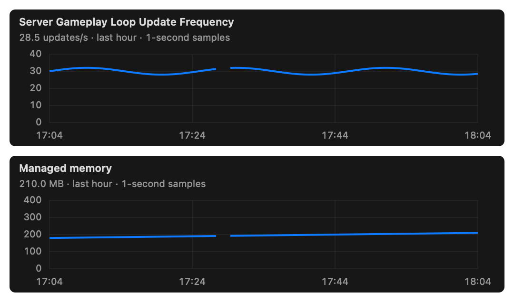

# Valheim Server Manager for Mac

Host Valheim worlds for your friends from your Mac. This native macOS menu bar app downloads the dedicated server, creates or imports worlds, and runs multiple servers without leaving a terminal open.

**[Download for Mac](https://github.com/GlacianNex/valheim-mac-server/releases/latest)** · [What's new in 1.3](docs/RELEASE-NOTES-1.3.md) · [Setup and recovery](docs/SETUP.md)

Requires **macOS 13 Ventura or later**. The download includes Apple Silicon and Intel binaries and is Developer ID signed and Apple-notarized. No running Steam client, Steam account, CrossOver or separate plugin installation is needed.

## What it does

- **Create and import worlds.** Choose a seed, adjust world settings, or import a copy of an existing save. Imported settings and seeds are visible in the manager.
- **Run multiple servers.** Each has its own world, ports, logs, player status and startup settings.
- **Schedule restarts.** Pick a local time and daily, every-N-days or weekday schedules. Warn players, wait until empty, or skip an occupied server.
- **Manage players.** See connected players, select someone to kick or ban, review bans, and send messages to everyone on a server.
- **Watch performance.** One-hour graphs show gameplay loop update frequency and managed memory, sampled every second.
- **Keep servers current.** Get notified about official Valheim updates or enable automatic updates with player warnings and a save/stop/update/restart sequence.

## Get started

1. Download and unzip **Valheim-Server-Manager-for-Mac.zip**. Open the app and let it copy itself into Applications, or drag it there yourself. macOS may show its normal first-open confirmation.
2. In the setup window, choose **Install Native Server**. The app downloads the server from Valve. On Apple Silicon, Valve's download tool may need Rosetta; the app asks before installing it. The game server itself runs natively.
3. Choose **New Server…**. Give it a name, optionally set a world seed or import a save, and choose whether to **List my server**. Listed servers require a password; unlisted servers can have an empty password. A blank seed creates a random world.
4. Hover over the server in the menu and choose **Start Server**. Once it is online, copy its join code to share with friends. With crossplay disabled, the submenu instead provides a copyable public IP address and the server’s port. Steam-only connections from outside your network require router forwarding for the configured UDP port and the next port; the displayed address does not confirm that forwarding is working.

Crossplay is enabled by default and uses Valheim's relay networking. Steam-only hosting requires forwarding the chosen UDP port and the next port on your router. Each simultaneous server needs its own unused port pair.

Allow at least **6 GB** for setup, plus space for world saves, each managed server's runtime and its rollback copy. APFS clones reduce physical disk use where available.

## Server Management

Open a server's submenu and choose **Server Management…**. The menu stays compact; the window contains:

- **Performance:** a **Server** tab with performance graphs, plus a **Ping** tab with per-player latency graphs for Steam-only servers.
- **Automation:** start that server at login and configure scheduled restarts.
- **Moderation:** connected players, saved bans and confirmation-based Kick, Ban and Unban controls. Ban changes persist across restarts. Admin and permitted-player IDs are managed here too; stop the server to edit those lists.
- **World Control:** Messages, Time and Raids. Broadcast messages and configure a private welcome message. Skip to the next morning, skip ahead 3, 6 or 12 in-game hours, stop a raid, start one near a connected player, or pause new raids for 15–120 real minutes. Time and raid changes require confirmation. A pause ends when its timer expires or the server restarts; stopping a raid leaves existing creatures alive.

Status, player count, version, uptime and bundled-mod switches stay above the tabs. **Backups** has its own tab for world saves, named backups and restoration while stopped, with a recovery backup before restoring. **Mods** shows each server's mod selection and runtime status, with access to the catalog and server folder.

The same window has buttons for Start/Stop Server, World Settings, logs and deletion. The log viewer separates server and manager activity, refreshes every second, and supports filtering, wrapping, auto-scroll and line numbers that stay out of copied text. Settings remain viewable while a server runs, but editing requires stopping it. Deleted worlds and settings are kept in a recovery folder.



*Performance graphs in 1.2.4, shown with sample data. Gaps indicate unavailable readings.*

The manager collects readings while management windows are closed. Keep the manager running in the menu bar to retain the last hour; quitting it clears this in-memory history. Gameplay loop frequency measures server simulation updates, not client graphics FPS. Managed memory excludes native allocations. **Performance → Ping** shows a separate graph for each connected Steam player, sampled once per second with the same one-hour background history. The tab is disabled for crossplay servers, which do not expose reliable ping through this interface. Missing measurements leave gaps rather than appearing as zero; restart the server after installing updated management tools to enable readings.

## Restarts and updates

**Scheduled restarts** affect one server. They save the world before restarting and leave deliberately stopped servers stopped. When warnings are selected, players see them in chat and on screen at **15, 10, 5 and 1 minute**. The maintenance log records the restart reason and the join code reported after startup. Keep the manager running for schedules to work.

**Official Valheim server updates** are checked at launch and every **10 minutes**. A yellow **!** in the menu bar and beside **Update Valheim Server…** indicates a newer build. The grey **Valheim Server Build** row shows Valve's installed Steam build ID.

Enable **Automatically Update All Valheim Servers** to install new stable builds automatically. It is off by default and preserves your choice on upgrade. All worlds share the official server installation, so an update coordinates all running servers: warn players, save, stop, update, then restart those that were running. Without working management tools, automatic updates wait until servers are confirmed empty; unknown player counts block the update. Progress follows **Stopping → Updating → Starting**.

**Manager app updates** are separate. The top menu line checks GitHub at launch and every **six hours**. It stays grey when up to date and becomes clickable when **Update Available** appears. Clicking downloads and verifies the new app, saves and stops hosted servers, installs the update and reopens the manager. Previously running servers and servers marked for auto-start restart afterward. You can also open a newer downloaded app and accept its update prompt.

For cancellation, failed updates and rollback, see [setup and recovery](docs/SETUP.md).

## Management tools are included

The app bundles a tested native Mac BepInEx loader, Jötunn 2.30.2, and its own RCON companion for warnings, performance, messaging, moderation and optional world controls. Installing the tools does not change gameplay rules; time and raid changes require explicit actions in World Control. Players do not need client mods. Each server has a separate managed runtime and a private, authenticated connection accessible only on this Mac.

- New servers install the tools on first start.
- Existing servers without a previous management preference get them automatically while stopped after updating the manager. Running servers wait until they stop or restart.
- An explicit choice to disable tools is preserved. Change it at the top of **Server Management** while stopped.

Compatible tool updates ship with manager updates and are applied automatically for enabled servers, using warned maintenance when a restart is needed. The app does not fetch arbitrary upstream BepInEx releases. It verifies package hashes, preserves configuration and credentials, and retains the previous runtime for recovery. Worlds remain separate from tool installations.

Above the management tabs, **Server Management Mods** and **Network Optimization Mods** are independent switches. Both use the shared BepInEx + Jötunn core; with both off and no custom mods enabled, the server starts without plugins. Custom mods still require the BepInEx + Jötunn core. Stop the server before changing either option. Disabling management makes Moderation and World Control unavailable. Automation remains available, but player warnings require management.

Network optimization is off by default and bundles **NetworkPerformanceSystem 1.6.0**. It changes traffic handling and simulation ownership; it is not a guarantee of lower latency. Version 1.6.0 is pinned while an [animal-position regression reported with 1.9.0](https://github.com/MidnightsFX/Valheim-Network-Performance-System/issues/5) remains unresolved. The reporter found that reverting to 1.6 helped. Native Mac loading and restarts have been tested; multiplayer behavior still needs testing with your players. Do not combine NPS with other networking overhauls. Licenses and the NPS source archive are included in the app's Management resources.

Version **1.3** adds a per-server Mods table and **Open Mod Catalog**. The catalog combines available mods from Thunderstore and Hexium. Known incompatible and client-only packages are hidden; missing platform metadata does not establish compatibility. Bundled components are marked as included or installed and remain controlled by the switches above the tabs. Standalone mod managers such as r2modman and Gale are excluded. Dependencies already supplied by the manager or satisfied by an installed version are reused; only missing dependencies are downloaded.

**Install Mod + Dependencies** shows the packages that will be added. **Install from File…** accepts a ZIP, folder or DLL and treats custom files as unverified. Both enable the selection for the next server start. Dependencies already in the library are enabled automatically; unresolved requirements, version conflicts and disabling a dependency still in use are blocked. Imported packages without full metadata may have undeclared requirements; successful import is not a compatibility guarantee.

Installation uses per-server folders and file receipts, preserves configuration files, and stages changes before replacing the runtime. The Mods table distinguishes pending changes, installed files, loaded plugins, loader failures and attributed runtime errors. Manually copied DLLs are also listed. Live plugin details require Server Management Mods and a fresh server start with the updated management bridge. Files alone never prove a plugin loaded successfully.

## Saves, storage and hosting limits

Data stays outside the app bundle, so replacing the app preserves your worlds and settings. The directory retains its original name for compatibility:

```text
~/Library/Application Support/Valheim Server Monitor/
  profiles.json        # settings and passwords; owner-readable/writable only
  worlds/<profile>/    # world saves
  runtime/             # SteamCMD and the shared official Valheim server
  management/<profile>/ # isolated managed runtime, tools and credentials
  logs/                # shared tools, maintenance and original server logs
  servers/<profile>/   # additional servers' process state and logs
  deleted-servers/     # recoverable deleted worlds and settings
```

Imports copy a one-world ZIP, modern world folder, or legacy `.db` with its matching `.fwl`. Use a consistent backup or stop the source server first. Imports check required files and packaging, not every world chunk. Saved world modifiers can persist; the editor explains when a setting inherits from the save rather than overriding it.

The manager controls only its own servers, identifying them by PID, executable path and process start time. It does not discover or take over independent servers or CrossOver installations. It prevents idle sleep while hosting, but closing a laptop lid, logging out or shutting down can interrupt hosting. Login startup happens **after a user signs in**, not before login. Quitting the manager leaves servers running, but stops monitoring, scheduled restarts and automatic updates until it reopens.

Menu-bar player counts use the latest count reported in server logs. The management companion reports count changes for both Steam and crossplay servers, checking once a second and repeating the count every minute. Without management tools, counts depend on the official server’s log messages and may be delayed or unavailable. The management window queries connected players through the companion. This is not an in-game activity history or a remote administration service.

Native runtime tests run on Apple Silicon; the Intel app has also been tested under Rosetta. Physical Intel and macOS 13 hardware coverage remains pending. See [verification and coverage limits](docs/VERIFICATION.md).

## Build and contribute

Use macOS with a current Xcode/Swift toolchain. Unit tests do not need downloaded game files:

```sh
swift test
```

To package the full app, also install **.NET 8** and provide the native Valheim server's reference assemblies:

```sh
export GAME_MANAGED_PATH="/path/to/server/valheim_server/Data/Managed"
scripts/build-management.sh
scripts/build.sh
```

The universal app and ZIP are written to `dist/`. Source builds are development artifacts unless you configure Developer ID signing and notarization. Follow [contributing instructions](CONTRIBUTING.md) for isolated development with `VSM_HOME`, and [release instructions](docs/RELEASING.md) for distribution.

## License and attribution

The manager, its original icon and its RCON companion are MIT licensed. Bundled third-party management components retain their own licenses and notices; the package includes those notices and Doorstop's corresponding source. Valheim and SteamCMD are downloaded from Valve, not redistributed in the app ZIP. No game assets, game DLLs or Valheim logos are bundled.

This is an unofficial community tool, not affiliated with Iron Gate, Coffee Stain, Valve or Apple.

### Local experimental builds

For internal testing, use `scripts/build-experimental.sh` with the same signing settings as a normal build. This keeps the public version unchanged and displays **Valheim Manager · Experimental**. An internal UTC build timestamp is available in the menu tooltip. Run `scripts/notarize.sh` after signing before sharing the ZIP.

An experimental download can replace a stable or experimental installation, even with the same or a lower public version. The normal installation confirmation, signature verification, world preservation and server restart flow still apply. Public manager update checks are disabled while Experimental is installed; official Valheim server updates are unaffected. To return to a public release, quit the manager and replace the app in Applications using Finder. Experimental builds are local artifacts, not GitHub releases.
